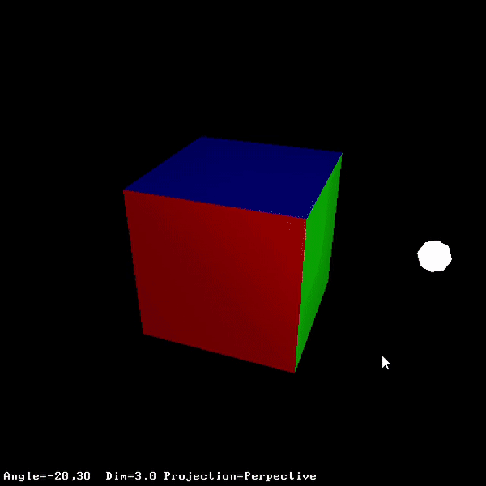
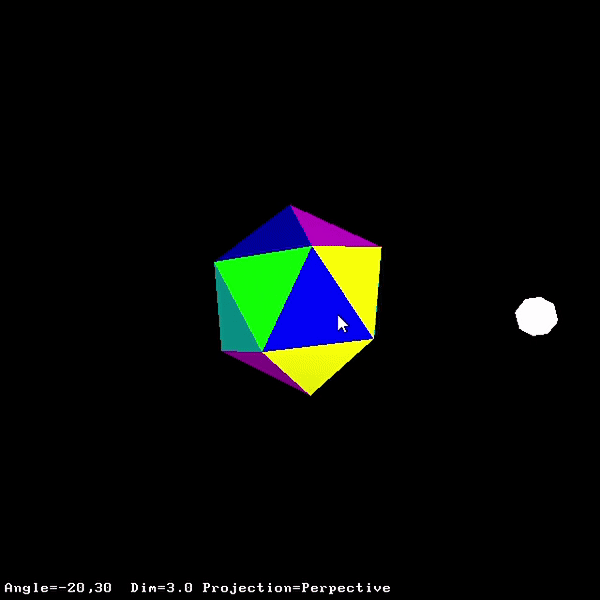

Procedural Texture: Fire Shader

This shader is meant to simulate burning, similar to when a piece of paper burns up. I made a function that describes the edge of a complex 3d object, with lots of local noise provided by sin and cos functions. If a fragment is inside the edge, it is discarded. If a fragment is outside but close to the edge, it is colored to create a burning effect. This edge grows with the uniform time variable, so it consumes the object as time progresses. The origin of the burn is also passed, along with some parts for the function that are calculated by the cpu for efficiency.

Examples:

Key bindings
	m          Toggle light movement
	o          Change objects
	arrows     Change view angle
	PgDn/PgUp  Zoom in and out
	0          Reset view angle
	ESC        Exit

	space      Start burning
	r          Reset shader

Notes: 
If no object is visible, it is probably because it fully burnt away. Press space to start it burning again or r to reset it entirely.
For some of the objects, it takes a couple seconds for the effect to become visible.
